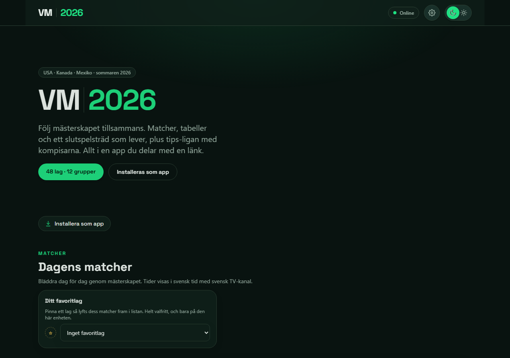
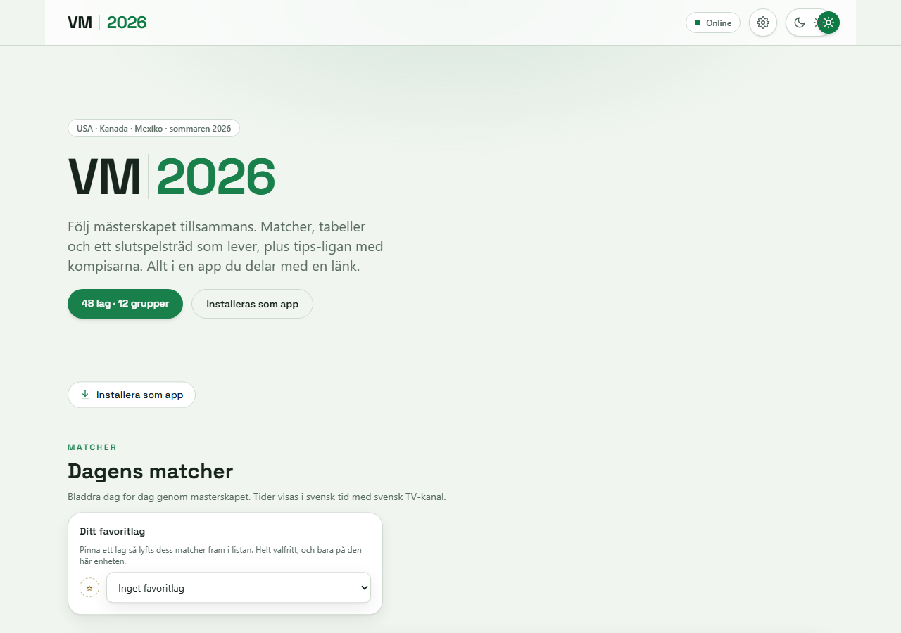
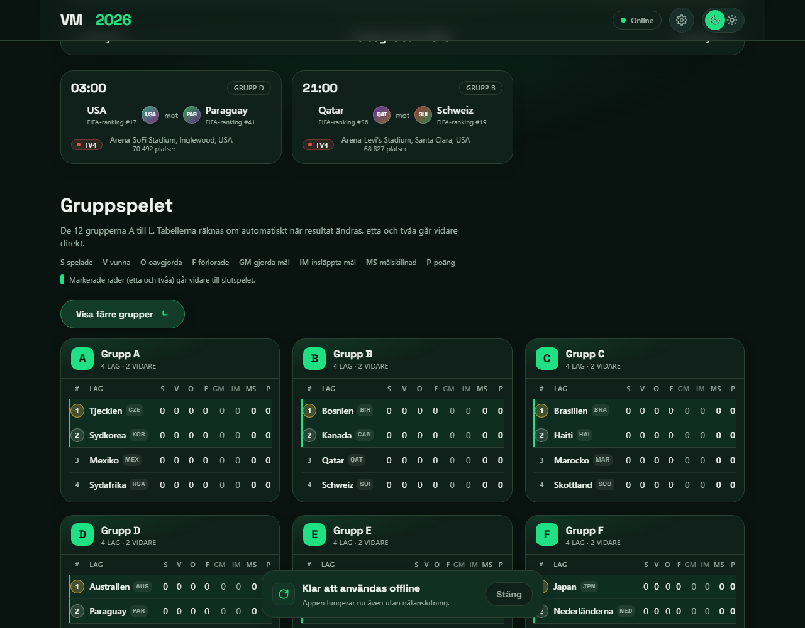
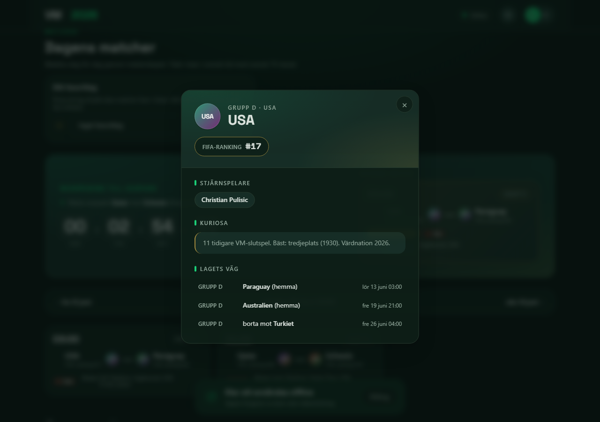
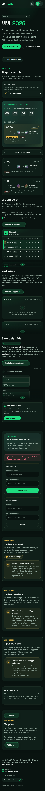
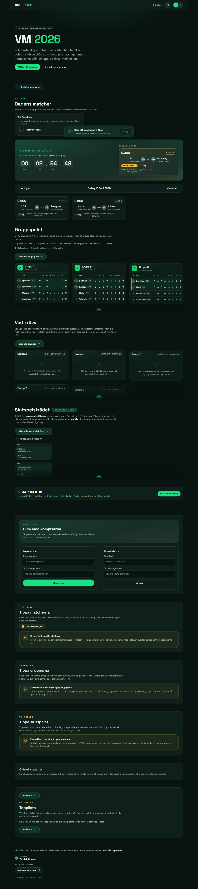

# VM 2026

🇬🇧 English version: [README.en.md](README.en.md)

En proffsig, installerbar PWA för att följa fotbolls-VM 2026 tillsammans med vänner:
en delad live-tracker (matcher, grupptabeller, ett dynamiskt slutspelsträd, inmatning av
officiella resultat) och ett komplett tipsspel ovanpå (matchtips, grupptips, mästartips,
resultattavla, märken, reaktioner och kommentarer). Byggd och körd live för riktiga vänner
under turneringen.

> En not om språk: appen är på svenska, det är dess riktiga publik (vänner i Sverige), så
> skärmdumparna och texten i appen nedan är svenska med flit. En engelsk version av den här
> README:n finns på [README.en.md](README.en.md).

> Not om hur den byggdes: projektet byggdes task för task med en strikt kvalitets-pipeline,
> planering, tester, oberoende kodgranskning och en CI-grind på varje ändring. Arkitekturen,
> designbesluten och verifieringen nedan speglar den processen.

---

## Skärmdumpar

| Startsida (mörkt) | Startsida (ljust) |
| --- | --- |
|  |  |

| Grupptabeller | Lagprofil |
| --- | --- |
|  |  |

| Mobil (den primära ytan) | Idag-fliken |
| --- | --- |
|  |  |

Skärmdumparna genereras från den faktiskt byggda appen i fixtures-läge (utan backend) via ett
Playwright-skript, se [Regenerera skärmdumparna](#regenerera-skärmdumparna).

---

## Vad det är, och vad den användes till

VM 2026 är en installerbar webbapp (PWA) med fem flikar: **Idag, Tips, Topplista, Turnering**
och **Mer**. Den delades med vänner och klasskompisar som en länk, lades till på deras
hemskärmar på mobilen och användes flitigt genom hela VM 2026: man följde dagens matcher,
la in tips före avspark, såg grupptabellerna och slutspelsträdet uppdateras live, och tävlade
på resultattavlan i sin egen miniliga.

Appen är en klient-side SPA med hash-baserad flik-navigering (ingen server-router): varje
flik är djuplänkbar via URL-hash, layouten är mobil-först eftersom appen lever på en telefon
i en gruppchatt (flik-rad längst ned på mobil, app-bar med flikar högst upp på desktop), och
den fungerar offline när den väl är installerad.

---

## Funktionsturné (varje skärm)

Appen har två lager: en **live-tracker** som alla delar, och ett **tipsspel** ovanpå den.
Plus en uppsättning informationsskärmar runt båda.

### Live-tracker

- **Dagens matcher (Idag-fliken).** Dagens matcher med avsparkstid (i svensk lokal tid),
  svensk TV-kanal, vilken omgång det gäller och arenan. Bläddra dag för dag genom hela
  turneringen. En hero för "dagens match" och en nedräkning till nästa avspark. Dagens
  accent-tema skiftar med lagen som spelar.
- **Matchkort** komprimerar informationen visuellt i stället för en textrad: lagens emblem,
  TV-kanalen som en badge, omgången, och på varje kort **arenan (arena, stad, land) med dess
  kapacitet** och lagens **FIFA-ranking**.
- **Livescore direkt på kortet.** Under pågående matcher berikas varje matchkort med en live-panel:
  en mjukt tickande matchklocka (status-styrd och paus-säker, visar "Paus" under uppehåll, "45+"
  eller "90+" vid tavlans gräns, "Slut" när matchen är klar, aldrig en påhittad tid), live-ställning,
  målskyttar med assist, gula och röda kort samt byten. Allt direkt synligt utan att klicka. När
  ställningen ändras annonseras den för skärmläsare via en artig aria-live-region, så att ett nytt
  mål läses upp utan att flytta fokus.
- **"Visa mer" (utfällbar statistik och laguppställning).** En tydlig expandera-knapp fäller ut
  full matchstatistik (bollinnehav, skott, hörnor, offside och fler nyckeltal som jämförelse-staplar)
  samt laguppställning och formationer för varje lag, bakom ett ärligt löfte: knappen visas bara
  när det faktiskt finns data att visa.
- **Bläddringsbar historik.** Live-datan sparas permanent och fryses när en match är klar. Man kan
  bläddra tillbaka dagar efteråt och se statistik och målskyttar, inte bara för pågående matcher.
- **Live-uppdaterad topplista (Topplista-fliken).** Placeringarna rör sig i realtid medan
  matcher spelas - när ett mål bekräftas räknas poängen om och raderna glider till sina nya
  platser (preliminärt, märkt; det officiella facit rörs aldrig).
- **Gruppspelet, 12 grupper (A till L) (Turnering-fliken).** Live-uträknade tabeller (poäng,
  spelade, målskillnad, gjorda/insläppta mål) som uppdateras i samma stund ett resultat matas
  in. Tabellerna är härledda, lagras aldrig dubbelt.
- **Dynamiskt slutspelsträd.** Trädet från sextondelsfinal till final byggs och justeras under
  gruppspelet (vem kan möta vem), låses när grupperna är avgjorda, och animerar de avancerande
  lagen allteftersom slutspelsresultaten kommer in. Seedningen av de 8 bästa grupptreorna följer
  FIFA:s fasta, källverifierade tabell, aldrig gissad (det var en egen dedikerad, granskad
  data-task).
- **"Vad krävs"-scenarier.** Levande scenarier för sista omgången: vad ett lag behöver för att
  gå vidare, "om X vinner går Y vidare", de mest spännande minuterna i ett gruppspel.
- **Vad händer om-simulator.** Spela upp hypotetiska resultat och se tabellerna och trädet
  förändras, tydligt märkt som en simulering så att ingen blandar ihop laboratoriet med riktig
  data.
- **Rik turneringsstatistik (Turnering-fliken).** Skytteliga och assist-liga, kort-liga (spelare
  och lag), snabbaste mål, mål-fördelning över matchtiden, flest mål per lag, mål per match,
  clean sheets, största skrällarna (ranking-baserat) och avstängda spelare (härlett ur
  kort-data). Near-live ur den verkliga matchdatan.
- **Sektions-meny i Turnering.** En sektions-meny som hoppar direkt till rätt del (Grupper,
  Vad krävs, Slutspel, Skytteligan, Statistik, Avstängda).
- **Lagprofiler.** Tryck på vilket lag som helst för att se dess FIFA-ranking, stjärnspelare,
  kuriosa och lagets väg genom gruppen, i en proffsig och tillgänglig modal.
- **Inmatning av officiella resultat (endast admin).** De riktiga, gemensamma turneringsresultaten
  (sanningskällan som tabeller, träd och poäng läser från) kan bara skrivas av admin. Det är
  framtvingat på serversidan av Postgres Row Level Security, inte bara dolt i gränssnittet, och
  det bevisas med riktiga sessioner i integrationstester.
- **Auto-facit med manuell override.** När en match avslutas skrivs slutresultatet automatiskt som
  officiellt facit i tävlingen. Men admins manuella inmatning är alltid sista ordet: auto-facit fyller
  bara tomt och uppdaterar bara sina egna automatiska rader. En manuellt inmatad rad rörs aldrig av
  automatiken (varje resultat har en källa, och manuell vinner alltid). Det är en deklarativ SQL-regel,
  inte bara ett löfte i koden.

### Tipsspel

- **Matchtips (Tips-fliken).** Varje vän tippar resultatet före avspark. Poängen per match visas
  för varje match i tips-vyn, med en uppdelning av varför.
- **Gruptips.** Tippa grupettorna och grupptvåorna före gruppspelet, för bonuspoäng.
- **Mästar- / slutspelstips.** Tippa vilka som går vidare i varje slutspelsomgång, och vem som
  vinner VM (20 poäng), för bonuspoäng.
- **Resultattavla (Topplista-fliken).** Vem som tippar bäst, med en sammanfattning överst
  (totala poäng och placering) och poängen per match under.
- **Global topplista (alla rum).** Utöver din egen miniliga finns en samlad topplista över alla
  som spelar, i alla rum, så du ser var du ligger i hela fältet och inte bara i din egen krets.
  Bara säkra, publika fält visas (namn och poäng, aldrig någons tips eller privata data), och den
  räknas fram på serversidan över hela tävlingen.
- **Tips-avslöjande.** När avsparks-deadlinen låser ser alla vad var och en har tippat.
- **Märken.** Bedrifter (streaks, "förutspådde skrällen", "perfekt omgång" med flera).
- **Reaktioner.** En kurerad uppsättning emoji på matcher, en reaktion per person och match, och
  du ser vem som reagerade med vad.
- **Kommentarer per match.** En kort kommentarstråd per match inne i ett rum.
- **Favoritlag och personlig statistik.** Nåla fast ett favoritlag (en inställning per enhet) så
  att dess matcher flyter upp överst, och se din egen träffsäkerhet över tid.

### Rum, profil och introduktion

- **Miniligor (rum).** Flera vänkretsar, var och en sitt eget rum med sin egen rumskod, sina
  medlemmar och sin resultattavla. Vänner går med via en länk eller en kod.
- **Persistent rum-väljare.** Se vilket rum du är i och byt rum (eller skapa/gå med) från vilken
  flik som helst, via rum-väljaren i app-baren.
- **"Min sida" (Mer-fliken).** En personlig profil-hub med avatar och namn, din placering i aktivt
  rum, träffsäkerhet, dina rum och favoritlag.
- **Push-notiser (mål-push).** PWA-push när ett mål görs i en match man följer ("MÅL! Spanien
  2-1"), opt-in i Mer-fliken, med natt-läge (tyst på natten) och val av omfattning. Fungerar
  även när appen är stängd.
- **Kom igång / installera / PWA.** En introduktionsturné vid första besöket, en ärlig
  "lägg till på hemskärmen"-guide som anpassar sig till webbläsaren (aldrig en död knapp), och
  offline-stöd när den väl är installerad.

---

## Kör lokalt (viktigt)

Live-sajten driftsätts under turneringen; den kommer inte att stå uppe länge efteråt. Så det
här avsnittet är det hållbara sättet att se appen: klona och kör den. Det är verifierat mot
den faktiska koden (datakälls-grinden i `src/data/data-source.ts`, env-typningen i
`src/vite-env.d.ts`, `vite.config.ts` och `package.json`).

### Förkrav

- Node.js 22 eller nyare, och npm.
- Git.

### Läge A, kör med fixtures (ingen backend, standard)

Appen är **fixtures-först**: all statisk turneringsdata (lag, grupper, hela spelschemat) är
inbyggd i appen och källverifierad. Utan några Supabase-miljövariabler satta faller datalagret
tillbaka på fixtures automatiskt (med en synlig konsol-varning så att läget aldrig är tyst),
och alla sociala funktioner (rum, tips, resultattavla, admin) ligger vilande. Så hela trackern
kör med noll konfiguration:

```bash
git clone <repo-url> vm-2026
cd vm-2026
npm install
npm run dev
```

Öppna den utskrivna lokala URL:en (Vite, vanligen `http://localhost:5173`). Du får hela
trackern: dagens matcher, grupptabeller, det dynamiska trädet, "vad krävs", vad händer
om-simulatorn, lagprofiler, installation/offline, allt på inbyggd fixtures-data, inget konto,
inget nätverk.

Vad koden gör här: `getDataSource()` kontrollerar två villkor. (1) Är både
`VITE_SUPABASE_URL` och `VITE_SUPABASE_ANON_KEY` satta och inte tomma? (2) Är live-klienten
byggd (`LIVE_READY`)? Live väljs bara när båda är sanna; annars returneras fixtures-källan.
Utan någon `.env` är villkor 1 falskt, så du får fixtures.

### Läge B, koppla din egen Supabase (alla sociala funktioner)

För att köra tipsspelet, rum, resultattavla, reaktioner, kommentarer och admin-inmatning av
resultat pekar du appen mot ditt eget Supabase-projekt. De två miljövariablerna läses via
`import.meta.env` och måste använda Vites `VITE_`-prefix:

| Variabel | Vad det är |
| --- | --- |
| `VITE_SUPABASE_URL` | Din Supabase-projekt-URL |
| `VITE_SUPABASE_ANON_KEY` | Din Supabase publishable (anon)-nyckel, publik med flit, skyddad av Row Level Security |

Det finns ingen incheckad `.env`-mall (env-filer är gitignorerade, inga hemligheter i repot), så
skapa den lokala filen själv:

```bash
# .env.local  (gitignored)
VITE_SUPABASE_URL=https://YOUR-PROJECT.supabase.co
VITE_SUPABASE_ANON_KEY=YOUR-ANON-KEY
```

Applicera databasschemat från `supabase/migrations/` på ditt projekt (tabeller, RLS-policyer,
RPC:er och realtids-publikation) med Supabase-CLI:t eller dashboarden, se
[`supabase/README.md`](supabase/README.md). Sedan:

```bash
npm install
npm run dev
```

Med båda variablerna satta och inte tomma väljer `getDataSource()` live-klienten: en anonym
session skapas (en stabil identitet per enhet, så "gå med i ett rum" består över omladdningar),
och det sociala lagret (`src/data/rooms/`, tips, officiella resultat) pratar med ditt
Supabase-projekt under RLS.

Noter:
- En halv konfiguration (URL men ingen nyckel, eller bara blanksteg) räknas som inte konfigurerad
  och faller säkert tillbaka på fixtures, i stället för ett tyst trasigt live-läge.
- Den statiska tracker-datan (lag, grupper, schema) förblir inbyggd även i live-läge; bara det
  delade, föränderliga tillståndet (rum, tips, resultat, reaktioner, kommentarer) går genom
  Supabase.

### Bygg och förhandsgranska produktionsbygget

```bash
npm run build      # type-check (tsc -b) + Vite production build into dist/
npm run preview    # serve the built dist/ locally
```

---

## Teknik och arkitektur

**Stack**

- **Frontend:** React + TypeScript + Vite.
- **Styling och rörelse:** Tailwind CSS + Motion (paketet `motion`, tidigare Framer Motion);
  animationerna är det som får den att kännas levande.
- **PWA:** vite-plugin-pwa (installerbar, offline app-skal, manifest, ikoner, auto-uppdaterande
  service worker som aktivt söker efter nya versioner så att användare får uppdateringar utan
  att starta om manuellt).
- **Moln:** Supabase (Postgres + Auth + Realtime + Row Level Security).
- **Push-notiser:** web-push (VAPID) via Supabase Edge Functions - server-side mål-detektion
  som reagerar på live-data utan att röra pollaren, idempotent (inga dubbel-notiser), styrd av
  varje användares eget opt-in.
- **Hosting:** Cloudflare Pages (git-integration, inga hemligheter i repot). Produktion
  driftsätts från `develop`; varje pull request får sin egen preview-URL.

**Arkitektur**

- **Härlett tillstånd från en sanningskälla.** Tabeller, trädet, poäng och resultattavlor
  lagras aldrig dubbelt. De räknas fram av små, rena, hårt testade funktioner från
  matchresultaten plus tipsen. Det är ryggraden som gör den kniviga FIFA-seedningen av
  grupptreor testbar och säker.
- **Källankrad data (gold source, regenerera-och-diffa).** Den statiska turneringsdatan
  (spelschema, lagprofiler, arenakapaciteter, grupptre-tabellen) genereras från incheckade
  källutdrag (med URL:er och hämtdatum) av rena parsers, värdelåses sedan och verifieras av ett
  regenerera-och-diffa-test, så att datan i appen bevisligen matchar sin källa och inte kan
  driva.
- **Fixtures-först med miljö-grind.** All kod byggs och testas mot typade fixtures; en enda grind
  växlar till live-Supabase via miljövariabler utan att ändra något anropsställe. Det är vad som
  lät hela appen byggas och testas före, och oberoende av, något backend-konto. Livekortet renderas
  mot bundlad exempeldata i fixtures-läge; i live-läge läses datan ur Supabase (publik läsning,
  realtidsuppdaterad) som matas av en budget-medveten schemalagd edge-funktion mot en betald
  Pro-plan för fotbolls-data (rikare data: events, statistik och laguppställningar) som pollas
  near-live.
- **5-flik klient-side SPA.** Fem flikar (Idag, Tips, Topplista, Turnering, Mer) med
  hash-baserad navigering; varje flik är djuplänkbar. Vendor-kodsplittning (React, Motion,
  Supabase) håller den initiala laddningen lätt.

---

## Kvalitet

| Vad | Kommando |
| --- | --- |
| Bygg (type-check + bundle) | `npm run build` |
| Enhets- / komponenttester (Vitest) | `npm test` |
| End-to-end (Playwright) | `npm run test:e2e` |
| Lint | `npm run lint` |
| Formatkontroll | `npm run format:check` |

- **2926 passerande tester** över 276 testfiler (Vitest) på en färsk klon, med 56 tester som
  hoppas över med flit (live-Supabase RLS-integrationstesterna, som bara körs när Supabase-env
  är konfigurerat, se nedan). Verifierat genom att köra `npm test`.
- **Säkerhet bevisad, inte antagen.** Row Level Security-modellen (bara admin kan skriva
  officiella resultat; bara rumsmedlemmar kan läsa ett rum; ingen kan förfalska en annan
  användares data) bevisas med riktiga anonyma Supabase-sessioner i `*-rls.integration.test.ts`.
  De testerna körs mot ett live-projekt bara när `VITE_SUPABASE_URL` / `VITE_SUPABASE_ANON_KEY`
  är satta i miljön, och hoppas annars över rent, så att enhetssviten är grön på en färsk klon
  utan hemligheter i repot. En mock kan inte bevisa RLS, som bor i databasen, så de använder
  riktiga sessioner med flit.
- **End-to-end (Playwright).** Kritiska användarflöden plus en axe-core WCAG AA-tillgänglighetskoll
  i både ljust och mörkt tema, körda mot det byggda `dist/` (artefakten som driftsätts) i
  fixtures-läge, så att E2E inte behöver några hemligheter och är deterministisk. Första körningen
  behöver Chromium: `npx playwright install chromium`.
- **Gröna CI-grindar.** GitHub Actions kör bygg, test och lint på varje pull request mot
  `develop`. Hostingen bygger direkt från repot på Cloudflare Pages, så inga deploy-tokens lever
  i kodbasen.

---

## Regenerera skärmdumparna

README-skärmdumparna i `docs/screenshots/` genereras från den faktiskt byggda appen i
fixtures-läge (utan backend), med samma upplägg som E2E-sviten:

```bash
npx playwright test scripts/capture-screenshots.spec.ts --config scripts/screenshots.config.ts
```

Det här bygger appen, serverar det byggda `dist/` med `vite preview`, och skriver PNG-filerna till
`docs/screenshots/`. Det är ett manuellt engångs-skript (det är inte en del av CI).

---

## Repo-karta

- App-kod: `src/` (funktioner i `src/features/`, datalager i `src/data/`, domänlogik i
  `src/domain/`).
- Databas: `supabase/migrations/` + [`supabase/README.md`](supabase/README.md).
- Design och beslut: [`docs/SPEC.md`](docs/SPEC.md), [`docs/decisions.md`](docs/decisions.md),
  [`docs/deploy.md`](docs/deploy.md).
